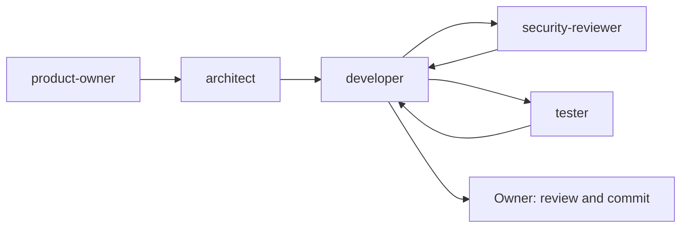

# Agent team

Personal Hub is built with a small team of custom AI agents in VS Code. Each agent has one role, a minimal set of tools and clear limits. They are defined in `.github/agents/`. Shared rules for all agents live in [AGENTS.md](../AGENTS.md).

## Roles

| Agent | Purpose | Tools | Must not |
|---|---|---|---|
| `product-owner` | Turns ideas into user stories with acceptance criteria, maintains the roadmap | read, search, edit | change code or decide architecture |
| `architect` | Prepares decisions with options and trade-offs, records confirmed decisions | read, search, edit, web | change code, decide alone |
| `developer` | Implements in small steps with tests, runs `npm run check` | read, search, edit, execute, todo | commit or push |
| `security-reviewer` | Reviews auth, sessions, SQL, secrets, vault | read, search | change any file, run commands |
| `tester` | Finds missing test cases and writes tests | read, search, edit, execute | change production code |

## Workflow

Agents are connected with **handoffs**: after a response, a button switches to the next agent with a pre-filled prompt. The human stays in control of every step and is the only one who commits and pushes.

Orchestration (an agent delegating to the others as subagents) is deliberately not used yet. It may be added later once the manual workflow is well understood.

## Design principles

- **Single role per agent.** A focused agent follows its instructions better than a generalist.
- **Least privilege.** The reviewer cannot edit files; the product owner and architect cannot touch code; the tester cannot change production code. Restrictions are enforced by the tool list, not only by instructions.
- **Humans decide.** Agents present options and ask before architecture decisions, commits and pushes.
- **State lives in the repository.** `AGENTS.md`, `docs/ARCHITECTURE.md` and `docs/ROADMAP.md` carry rules, decisions and progress, so every new chat can continue with `/continue`.
- **Fast feedback.** `npm run check` (lint, typecheck, tests) is the objective gate for every change.

## Using the team

1. Select an agent in the chat agent dropdown.
2. Describe the task, or follow a handoff button from the previous agent.
3. Review the result and move on to the next role.

Typical feature: `product-owner` writes the story, `architect` clears open decisions, `developer` implements with tests, `security-reviewer` and `tester` check, and the owner commits.

## Learnings

To be filled in while using the team on real features: what worked, what needed adjusting, and examples of useful reviews.
