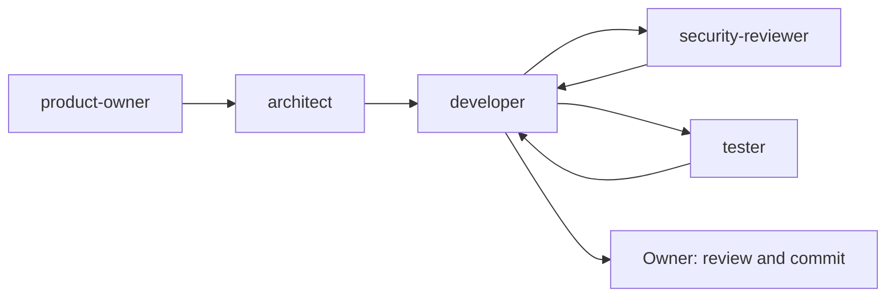

# Agent team

Personal Hub is built with a small team of custom AI agents in VS Code. Each agent has one role, a minimal set of tools and clear limits. They are defined in `.github/agents/`. Shared rules for all agents live in [AGENTS.md](../AGENTS.md).

## Roles

| Agent               | Purpose                                                                       | Tools                             | Must not                           |
| ------------------- | ----------------------------------------------------------------------------- | --------------------------------- | ---------------------------------- |
| `product-owner`     | Turns ideas into user stories with acceptance criteria, maintains the roadmap | read, search, edit                | change code or decide architecture |
| `architect`         | Prepares decisions with options and trade-offs, records confirmed decisions   | read, search, edit, web           | change code, decide alone          |
| `developer`         | Implements in small steps with tests, runs `npm run check`                    | read, search, edit, execute, todo | commit or push                     |
| `security-reviewer` | Reviews auth, sessions, SQL, secrets, vault                                   | read, search                      | change any file, run commands      |
| `tester`            | Finds missing test cases and writes tests                                     | read, search, edit, execute       | change production code             |

## Workflow

Agents are connected with **handoffs**: after a response, a button switches to the next agent with a pre-filled prompt. The human stays in control of every step and is the only one who commits and pushes.

For security-sensitive changes (auth, sessions, SQL, secrets, vault, guards) the `security-reviewer` runs before or together with the `tester`, so the tester does not build tests on unsafe behaviour.

Orchestration (an agent delegating to the others as subagents) is deliberately not used yet. It may be added later once the manual workflow is well understood.

## Design principles

- **Single role per agent.** A focused agent follows its instructions better than a generalist.
- **Least privilege.** The reviewer cannot edit files; the product owner and architect cannot touch code; the tester cannot change production code. Restrictions are enforced by the tool list, not only by instructions.
- **Humans decide.** Agents present options and ask before architecture decisions, commits and pushes. Which agents take part in a task is also the owner's decision: the chain is proposed and confirmed, never shortened or extended silently.
- **State lives in the repository.** `AGENTS.md`, `docs/ARCHITECTURE.md` and `docs/ROADMAP.md` carry rules, decisions and progress, so every new chat can continue with `/continue`.
- **Fast feedback.** `npm run check` (lint, format check, typecheck, tests) is the objective gate for every change.

## Using the team

1. Select an agent in the chat agent dropdown.
2. Describe the task, or follow a handoff button from the previous agent.
3. Review the result and move on to the next role.

Typical feature: `product-owner` writes the story, `architect` clears open decisions, `developer` implements with tests, `security-reviewer` and `tester` check, and the owner commits.

## Learnings

First real feature: the database foundation.

### What worked

- The `product-owner` -> `architect` chain: the story arrived with questions and recommendations. The architect verified facts on the web (PostgreSQL 18 image volume path `/var/lib/postgresql`, node-pg-migrate 9 specifics) and disagreed with the product-owner on 3 of 13 points. The owner answered all decisions in one message ("all as recommended").
- The `security-reviewer` found real weaknesses in the test-database guards that neither developer nor tester had noticed: query parameters like `?host=` redirecting the connection, no host restriction, and `TRUNCATE` without checking the connected database. A second pass found only low findings.
- Splitting the story into three parts (a, b, c) with manual Docker verification and one commit each kept steps small.

### What needed adjusting

- The main chat silently skipped agents (architect, tester, security-reviewer) for a small task. Result: the rule in `AGENTS.md` that the chain is proposed and confirmed.
- `format:check` turned `check` red, so the developer now runs `npm run format` before handing over.
- The owner edited files between agent runs, so agents must re-read current contents before editing.
- The tester wrote tests that documented too-loose behaviour (string-only URL comparison, host `127.0.0.1` accepted), which had to be changed deliberately later. The tester now reports such cases instead.
- The product-owner raised architecture questions that belonged to the architect.
- Not found by the agents, raised by the owner: the Node 20 deprecation warning in CI, the `npm audit` advisory and the question of a pre-commit hook.
- A test passed locally but failed in CI: the agents always had a `.env`, and without it Node prints a notice for `--env-file-if-exists` that broke exact-output assertions. The developer now also runs `npm run test:unit` without a `.env` before handing over.
