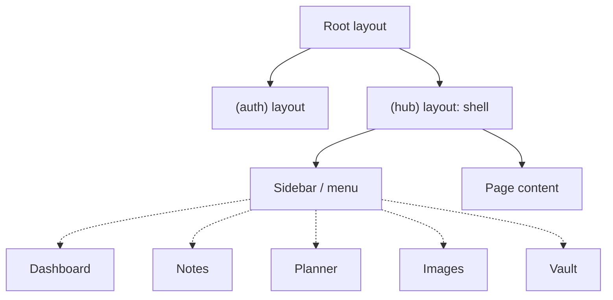
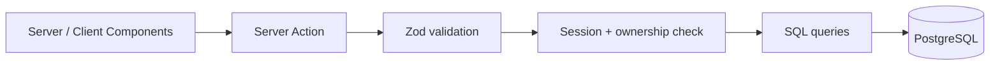

# Architecture

Personal Hub is a single Next.js application (App Router) organised as a modular monolith.
Each feature (notes, planner, images, vault) is an isolated module behind a shared navigation shell.

## Stack

| Concern                | Choice                                                                                                                                                 | Status                     |
| ---------------------- | ------------------------------------------------------------------------------------------------------------------------------------------------------ | -------------------------- |
| Framework              | Next.js 16 (App Router), React 19, TypeScript                                                                                                          | Decided                    |
| Styling                | Tailwind CSS 4                                                                                                                                         | Decided (scaffold default) |
| Database               | PostgreSQL (runs locally in Docker, self-hosted, and in the cloud)                                                                                     | Decided                    |
| ORM                    | None for now; plain SQL with a PostgreSQL driver                                                                                                       | Decided                    |
| DB driver / migrations | `pg` + `node-pg-migrate` (SQL migration files)                                                                                                         | Decided                    |
| Auth                   | Custom: Argon2 password hashes, DB sessions, HttpOnly cookie                                                                                           | Decided                    |
| Mutations              | Server Actions (REST only where needed, e.g. image upload/serving)                                                                                     | Decided                    |
| Validation             | Zod at every boundary                                                                                                                                  | Decided                    |
| Image storage          | Storage adapter, metadata in DB                                                                                                                        | Proposed                   |
| Vault                  | Client-side encryption (Web Crypto)                                                                                                                    | Proposed                   |
| Tests                  | Vitest (unit, integration against a real test database), Playwright (few end-to-end flows, added with the first UI flows); test files next to the code | Decided                    |
| UI language            | English                                                                                                                                                | Decided                    |

Only items marked "Decided" are confirmed. Everything else is a proposal and is discussed one by one before implementation.

## Deployment

One codebase, three ways to run it. All differences are configured through environment variables.

| Mode        | Where                                                       | Purpose                         | Data                                   |
| ----------- | ----------------------------------------------------------- | ------------------------------- | -------------------------------------- |
| Development | `npm run dev` + PostgreSQL in Docker                        | building and presenting locally | seed / demo data                       |
| Private     | Docker Compose (app + PostgreSQL) on the owner's computer   | real daily use                  | real data, persisted in Docker volumes |
| Public demo | Cloud (hosted Next.js + hosted PostgreSQL + object storage) | live link for applications      | demo data only                         |

Consequences:

- PostgreSQL everywhere; SQLite is not used because serverless hosting has no persistent file system.
- Image storage goes through a storage adapter: local volume (development, private) or object storage (public demo).
- The app ships a `Dockerfile` and `docker-compose.yml` for the private mode.
- Secrets and connection strings live in `.env`; `.env.example` documents all variables.
- The vault must not hold real credentials on the public demo.

### Demo account

- A seeded demo user with fake notes, planner entries and images, created by a seed script.
- A "Try demo" login on the public demo; the demo user cannot change the password or delete the account.
- The public demo resets its data on a schedule and applies rate limits and upload size limits.
- The same demo user can be seeded locally to present the app without exposing real data.

## Folder structure

```
src/
  app/                     # routing only: thin pages and layouts
    (auth)/                # no menu
      layout.tsx
      login/page.tsx
      register/page.tsx
    (hub)/                 # shell with navigation + auth check
      layout.tsx
      dashboard/page.tsx
      notes/page.tsx
      planner/page.tsx
      images/page.tsx
      vault/page.tsx
    api/                   # only where Server Actions do not fit
  features/                # one folder per module
    auth/ notes/ planner/ images/ vault/
      components/
      actions.ts           # writes (Server Actions)
      queries.ts           # reads
      schemas.ts           # Zod schemas
      *.test.ts
  components/
    layout/                # Sidebar, Topbar, MobileNav, UserMenu
    ui/                    # reusable primitives
  lib/                     # cross-cutting: db, auth, session, crypto, storage, navigation
db/migrations/           # SQL migration files
docs/
```

Rules:

- Feature modules never import from each other; shared code goes into `lib/` or `components/`.
- Pages in `app/` only compose feature components and queries.

## Layouts and navigation



- The `(hub)` layout renders the shell once; navigating between features keeps the menu mounted.
- Menu entries live in one list, `src/lib/navigation.ts` (label, route, icon). A new module is one folder plus one entry.
- The active item is highlighted by a small client component using `usePathname()`; the shell stays a Server Component.
- Responsive: fixed sidebar on desktop, collapsible menu on mobile.
- Each module has `loading.tsx` and `error.tsx` so the menu stays visible while content loads or fails.

## Request flow



- Reads happen in Server Components via `queries.ts`; writes go through `actions.ts`.
- Every action and query verifies the session and filters by `userId`.

## Access control

1. `proxy.ts` redirects unauthenticated requests to `/login` (first gate, optimistic only).
2. The `(hub)` layout checks the session again.
3. Every Server Action and query re-checks the session and ownership. This is the authoritative check.

## Data model (rough)

```
User ─┬─< Note          (title, content, tags)
      ├─< PlannerEntry  (title, start, end, recurrence)
      ├─< Image         (filename, storageKey, mime, size, album)
      └─< VaultItem     (encryptedBlob, iv)      User.vaultSalt
```

Every table carries `userId` and is always queried by it.

## Vault

- A separate master password derives the encryption key in the browser (PBKDF2 or Argon2 + AES-GCM). It is never sent to the server.
- The vault is locked by default, unlocked only in client memory, and locks again on leaving the page or after a timeout.
- The server only stores ciphertext, IV and salt.
- Treat it as a portfolio demo until reviewed; do not store real credentials.

## Security principles

- Authorisation is enforced on the server, never only in the UI.
- Uploads: validate type and size, never trust client file names.
- Secrets live in `.env`, never in the repository.

## Open decisions

- Auth details: password hashing library (`argon2` vs `bcrypt`), session lifetime, rate limiting.
