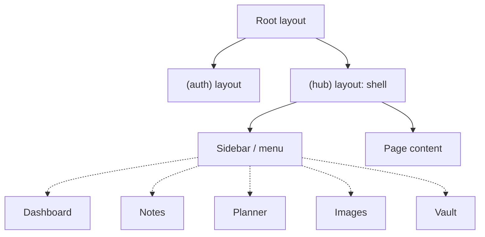
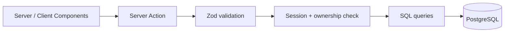

# Architecture

Personal Hub is a single Next.js application (App Router) organised as a modular monolith.
Each feature (notes, planner, images, vault) is an isolated module behind a shared navigation shell.

## Stack

| Concern                | Choice                                                                                                                                                 | Status                     |
| ---------------------- | ------------------------------------------------------------------------------------------------------------------------------------------------------ | -------------------------- |
| Framework              | Next.js 16 (App Router), React 19, TypeScript                                                                                                          | Decided                    |
| Styling                | Tailwind CSS 4                                                                                                                                         | Decided (scaffold default) |
| Database               | PostgreSQL (runs locally in Docker, self-hosted, and in the cloud)                                                                                     | Decided                    |
| ORM                    | None for now; plain SQL with a PostgreSQL driver                                                                                                       | Decided                    |
| DB driver / migrations | `pg` + `node-pg-migrate` (SQL migration files)                                                                                                         | Decided                    |
| Auth                   | Custom: Argon2 password hashes, DB sessions, HttpOnly cookie                                                                                           | Decided                    |
| Mutations              | Server Actions (REST only where needed, e.g. image upload/serving)                                                                                     | Decided                    |
| Validation             | Zod at every boundary                                                                                                                                  | Decided                    |
| Image storage          | Storage adapter, metadata in DB                                                                                                                        | Proposed                   |
| Vault                  | Client-side encryption (Web Crypto)                                                                                                                    | Proposed                   |
| Tests                  | Vitest (unit, integration against a real test database), Playwright (few end-to-end flows, added with the first UI flows); test files next to the code | Decided                    |
| UI language            | English                                                                                                                                                | Decided                    |

Only items marked "Decided" are confirmed. Everything else is a proposal and is discussed one by one before implementation.

## Deployment

One codebase, three ways to run it. All differences are configured through environment variables.

| Mode        | Where                                                       | Purpose                         | Data                                   |
| ----------- | ----------------------------------------------------------- | ------------------------------- | -------------------------------------- |
| Development | `npm run dev` + PostgreSQL in Docker                        | building and presenting locally | seed / demo data                       |
| Private     | Docker Compose (app + PostgreSQL) on the owner's computer   | real daily use                  | real data, persisted in Docker volumes |
| Public demo | Cloud (hosted Next.js + hosted PostgreSQL + object storage) | live link for applications      | demo data only                         |

Consequences:

- PostgreSQL everywhere; SQLite is not used because serverless hosting has no persistent file system.
- Image storage goes through a storage adapter: local volume (development, private) or object storage (public demo).
- The app ships a `Dockerfile` and `docker-compose.yml` for the private mode.
- Secrets and connection strings live in `.env`; `.env.example` documents all variables.
- The vault must not hold real credentials on the public demo.

### Demo account

- A seeded demo user with fake notes, planner entries and images, created by a seed script.
- A "Try demo" login on the public demo; the demo user cannot change the password or delete the account.
- The public demo resets its data on a schedule and applies rate limits and upload size limits.
- The same demo user can be seeded locally to present the app without exposing real data.

## Database foundation

Status: Decided (database foundation). Open points are listed under "Open decisions".

### Local PostgreSQL (part a)

- One PostgreSQL instance with two databases: `personal_hub` (development) and `personal_hub_test` (integration tests).
- Only PostgreSQL is containerised during development; the app runs on the host. The `Dockerfile` and the app service belong to the demo deployment step.
- The development file is `docker-compose.dev.yml`. `docker-compose.yml` is reserved for the self-hosting setup in the demo deployment step (required secrets, no weak defaults). npm scripts wrap `-f docker-compose.dev.yml`.
- Image `postgres:18` (Debian variant, floating minor); the data volume is mounted at `/var/lib/postgresql`.
- Development credentials come from `.env` via `${VAR:-default}`; the port is bound to `127.0.0.1` and overridable with `POSTGRES_PORT`.
- `.env` stays plain `KEY=value`. `.env.example` states that `DATABASE_URL` duplicates the Compose user, password and port.
- The migration CLI loads `.env` via `node --env-file-if-exists=.env`; there is no `dotenv` dependency.

### Pool and migrations (part b)

- The pool is a lazy singleton stored on `globalThis` and configured through `getEnv()`. There is no top-level pool, so `next build` needs no environment variables. An `end()`/reset hook is exposed for tests.
- Migrations live in `db/migrations`, one `.sql` file per migration with `-- Up Migration` and `-- Down Migration` markers. Shared options are in a JSON config file.
- Scripts: `db:migrate`, `db:migrate:down`, `db:migrate:create`, plus `db:up` and `db:down` for the Compose file.

### Integration tests (part c)

- `TEST_DATABASE_URL` has its own test-only Zod schema, not part of the app `envSchema`.
- Guards: the URL differs from `DATABASE_URL`, the database name ends in `_test`, and error messages never echo URLs. Decided extension (security review):
  - Differs from `DATABASE_URL` by normalised host, port and database name (`localhost`, `127.0.0.1` and `[::1]` count as one server; trailing slash and query are ignored), besides the plain string comparison.
  - The name matches `^[A-Za-z0-9_]+_test$` and is at most 63 bytes; any `%` in the path is rejected, so the validated name is exactly the one the driver connects to.
  - Local host only (`localhost`, `127.0.0.1`, `[::1]`) and never empty (an empty host falls back to `PG*` environment variables).
  - No query parameters except a valid `sslmode`, and no fragment; the driver turns other parameters (`host`, `port`, `user`, `options`, ...) into connection options that bypass the checks. A `%` in the query is rejected too (sslmode values never need escapes).
  - Any `%` not followed by two hex digits is rejected anywhere in the URL: the driver re-encodes the whole URL when it sees one, which could make it parse differently from the validator. Valid escapes such as `%40` in the password keep working.
  - An explicit port and a non-empty user name are required. For an empty port, user, password or `sslmode` the driver falls back to `PGPORT`, `PGUSER`, `PGPASSWORD` and `PGSSLMODE` (and `PGOPTIONS`), so `PG*` variables are not a supported way to configure the test connection. An empty password is still allowed (a trusted local server needs none, and `PGPASSWORD` cannot redirect the connection); `sslmode` and `PGOPTIONS` do not change the target. The default port is only assumed for `DATABASE_URL` in the same-database comparison.
  - `globalSetup` builds every driver client inside its error sanitiser, so a URL the driver cannot parse (for example `%FF` in the password) never leaks through a raw error.
  - A remote opt-in (for example `ALLOW_REMOTE_TEST_DB`) was deliberately not added.
- `truncateAllTables` checks `current_database()` and refuses to run unless the name is a valid `_test` name. The integration setup resets the env cache and closes the pool before setting `DATABASE_URL`.
- `globalSetup` forwards only a short error code and a hint, never the raw driver or migration runner error.
- The integration setup injects the test URL into `process.env.DATABASE_URL`, so app code stays unchanged.
- Migrations run once in Vitest `globalSetup` through the `node-pg-migrate` `runner()` API with an explicit URL. `globalSetup` also creates the test database if it is missing.
- Before each test, all tables except `pgmigrations` are cleared with `TRUNCATE ... RESTART IDENTITY CASCADE`. Integration files run serially.
- Upgrade path if the suite gets slow: one database per test file (template database).
- Integration tests run in the default `npm test` through two Vitest projects, `unit` and `integration`. Integration files are named `*.integration.test.ts` and sit next to the code.
- If the database is unreachable, `globalSetup` fails loudly with a hint (`npm run db:up`); it never skips silently.

### CI

- GitHub Actions uses `services: postgres` with a `pg_isready` health check, on the same major version as Compose. A comment in `ci.yml` points to the Compose tag.
- `npm run build` stays in a step without database variables.

## Folder structure

```
src/
  app/                     # routing only: thin pages and layouts
    (auth)/                # no menu
      layout.tsx
      login/page.tsx
      register/page.tsx
    (hub)/                 # shell with navigation + auth check
      layout.tsx
      dashboard/page.tsx
      notes/page.tsx
      planner/page.tsx
      images/page.tsx
      vault/page.tsx
    api/                   # only where Server Actions do not fit
  features/                # one folder per module
    auth/ notes/ planner/ images/ vault/
      components/
      actions.ts           # writes (Server Actions)
      queries.ts           # reads
      schemas.ts           # Zod schemas
      *.test.ts
  components/
    layout/                # Sidebar, Topbar, MobileNav, UserMenu
    ui/                    # reusable primitives
  lib/                     # cross-cutting: db, auth, session, crypto, storage, navigation
db/migrations/           # SQL migration files
docs/
```

Rules:

- Feature modules never import from each other; shared code goes into `lib/` or `components/`.
- Pages in `app/` only compose feature components and queries.

## Layouts and navigation



- The `(hub)` layout renders the shell once; navigating between features keeps the menu mounted.
- Menu entries live in one list, `src/lib/navigation.ts` (label, route, icon). A new module is one folder plus one entry.
- The active item is highlighted by a small client component using `usePathname()`; the shell stays a Server Component.
- Responsive: fixed sidebar on desktop, collapsible menu on mobile.
- Each module has `loading.tsx` and `error.tsx` so the menu stays visible while content loads or fails.

## Request flow



- Reads happen in Server Components via `queries.ts`; writes go through `actions.ts`.
- Every action and query verifies the session and filters by `userId`.

## Access control

1. `proxy.ts` redirects unauthenticated requests to `/login` (first gate, optimistic only).
2. The `(hub)` layout checks the session again.
3. Every Server Action and query re-checks the session and ownership. This is the authoritative check.

## Data model (rough)

```
User ─┬─< Note          (title, content, tags)
      ├─< PlannerEntry  (title, start, end, recurrence)
      ├─< Image         (filename, storageKey, mime, size, album)
      └─< VaultItem     (encryptedBlob, iv)      User.vaultSalt
```

Every table carries `userId` and is always queried by it.

## Vault

- A separate master password derives the encryption key in the browser (PBKDF2 or Argon2 + AES-GCM). It is never sent to the server.
- The vault is locked by default, unlocked only in client memory, and locks again on leaving the page or after a timeout.
- The server only stores ciphertext, IV and salt.
- Treat it as a portfolio demo until reviewed; do not store real credentials.

## Security principles

- Authorisation is enforced on the server, never only in the UI.
- Uploads: validate type and size, never trust client file names.
- Secrets live in `.env`, never in the repository.
- Dependency audit: Decided. CI has no `npm audit` step. The `braces` advisory (CVE-2026-93687, no patched version yet) reaches us only through the dev dependency chain `eslint-config-next` → `fast-glob` → `micromatch`; `npm audit --omit=dev` reports 0. It is accepted until `braces` is patched; Dependabot reports updates. Do not use `npm audit fix --force`, which would downgrade `eslint-config-next` to 14.

## Open decisions

- Auth details: password hashing library (`argon2` vs `bcrypt`), session lifetime, rate limiting.
- Separate E2E database `personal_hub_e2e` for Playwright (decide with the auth step).
- Least-privilege database roles: separate roles for migrations and the app.
- SSL mode for the hosted demo database (decide with the demo deployment).
- Whether Dependabot should also cover the `docker-compose` ecosystem.
